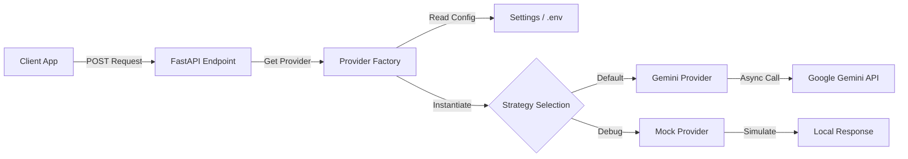

# 🎨 Immersive Craft AI Platform


> **Bridge the gap between handmade quality and professional online presentation.**

The **Immersive Craft AI Platform** empowers household artists to showcase their work professionally. 
This repository houses the backend microservices ecosystem, currently featuring the **Text Service** (Live) and the **Image Service** (In Development).

---

## 🧩 Microservices Overview

The platform is built on a scalable microservices architecture, separating lightweight CPU tasks from heavy GPU processing.

### 1. ✍️ Immersive Text Service (Live)
* **Status:** ✅ Production Ready
* **Role:** The "AI Storyteller"
* **Tech:** FastAPI, Async I/O, Google Gemini (Multimodal)
* **Function:** Transforms raw images and simple seller notes into evocative, SEO-ready product descriptions in milliseconds.

### 2. 📸 Immersive Image Service (In Development)
* **Status:** 🏗️ Construction in Progress
* **Role:** The "AI Photographer"
* **Tech:** Python, Celery, Redis, Kubernetes (GKE), KEDA
* **Function:** Asynchronous GPU pipeline for professional image correction:
    * Perspective Correction
    * Shadow Removal & Lighting Enhancement
    * AI Super-Resolution (Upscaling)
    * Background Manipulation
    * Intelligent Cropping
    * Interactive 3D Model

---

## 🏗️ Architecture

The platform uses a **Strategy Pattern** for flexible AI providers and an asynchronous event-driven architecture for handling heavy workloads.

### Text Service Workflow (Strategy Pattern)
A central Factory determines which AI Provider to instantiate based on runtime configuration, ensuring a unified interface (`AIModelProvider`) regardless of the underlying model.



### Image Service Workflow (Async GPU Pipeline)
Asynchronous GPU pipeline for professional image correction

Work in Progress (stay tuned)

---

## ✨ Key Features

The **Text Service**, a high-performance microservice that uses Multimodal AI to transform raw images and simple seller notes into evocative, SEO-ready product descriptions.

* **🧠 Multimodal AI:** Analyzes visual cues (images) combined with text inputs using **Google Gemini**.
* **🔌 Provider Factory Pattern:** flexible architecture allowing hot-swapping of AI backends (Gemini, OpenAI, etc.) via configuration.
* **⚡ High Performance:** Fully asynchronous (non-blocking) I/O using `httpx` and FastAPI.
* **🛡️ Robust Configuration:** Type-safe settings management using **Pydantic Settings** with nested environment variable support.
* **🧪 Developer Friendly:** Built-in **Mock Mode** for zero-cost testing and rapid UI development.

The **Image Service**, an asynchronous GPU pipeline for professional image correction
Work in Progress (stay tuned)

---

## 🚀 Quick Start

### Prerequisites

- Python 3.10 or higher
```bash
python3 --version
```
- [uv](https://github.com/astral-sh/uv) package manager (recommended) or `pip`

- A Google API key for Gemini (get one from [Google AI Studio](https://makersuite.google.com/app/apikey))

### Installation

1. **Clone the repository** (if not already done)
    ```bash
    git clone https://github.com/SuvroBaner/immersive
    cd immersive/services/text-service
    ```

2. **Install packages & dependencies (this will automatically create and manage the virtual environment)**
    ```bash
    # Using uv (recommended)
    uv sync
    source .venv/bin/activate  # On macOS/Linux
    # .venv\Scripts\Activate.ps1  # On Windows PowerShell
    ```

    Or using standard Python:

   ```bash
   python -m venv .venv
   source .venv/bin/activate
   ```

3. **Configure environment variables**

   Create a `.env` file in `services/text-service/`:

   ```bash
   touch .env  # or use your preferred editor
   ```

   Make a copy of example.env
   ```bash
   # Create .env file
    cp example.env .env
    ```

   Add your configuration:

   ```env
   # Default provider (gemini, mock)
   DEFAULT_PROVIDER=gemini
   
   # Enable mock mode for testing (set to true to bypass API calls)
   MOCK_MODE=false
   
   # Provider-specific settings (Gemini)
   # Note: Use double underscores (__) to nest settings
   PROVIDER_SETTINGS__GEMINI__API_KEY=your_google_api_key_here
   PROVIDER_SETTINGS__GEMINI__MODEL_NAME=gemini-2.5-flash

   # OPENAI (for future use/testing)
   # PROVIDER_SETTINGS__OPENAI__API_KEY=sk-yyy
   # PROVIDER_SETTINGS__OPENAI__MODEL_NAME=gpt-4o-mini
   ```

   **Important:** The nested configuration format (`PROVIDER_SETTINGS__GEMINI__API_KEY`) is required. This allows Pydantic to properly map environment variables to the nested `ProviderConfig` structure.

4. **Run the Server**

   ```bash
   # From services/text-service/
   uvicorn app.main:app --reload --port 8000
   ```

   The API will be available at `http://127.0.0.1:8000`

   - **Interactive API Docs:** http://127.0.0.1:8000/docs
   - **Alternative Docs:** http://127.0.0.1:8000/redoc

---

## 📚 API Documentation (Text Service)

### Endpoints

#### `GET /`
Health check endpoint.

**Response:**
```json
{
  "status": "ok",
  "service": "text-service"
}
```

#### `GET /v1/providers`
List available AI providers and their configuration status.
Useful for debugging if your .env keys are being loaded correctly (without leaking the actual keys).

**Response:**
```json
{
  "default_provider": "gemini",
  "mock_mode": false,
  "available_providers": ["gemini", "mock"],
  "configured_providers": {
    "gemini": {
      "model_name": "gemini-2.5-flash",
      "api_key_configured": true
    }
  }
}
```

#### `POST /v1/content/generate`
Generate product descriptions, titles, and structured marketing content from an image and seller inputs.

**Query Parameters:**
- `provider` (optional): Override the default provider (e.g., `?provider=gemini`)

**Request Body:**
```json
{
  "image_url": "https://example.com/product-image.jpg",
  "seller_inputs": {
    "item_name": "Handcrafted Clay Pot",
    "materials": "Natural terracotta clay, white paint",
    "inspiration": "Made during the rainy season, inspired by my garden",
    "category": "Pottery"
  },
  "config": {
    "tone": "evocative",
    "language": "en-IN",
    "target_platform": "web"
  }
}
```

**Response:**
```json
{
  "generated_content": {
    "title": "Handcrafted Clay Pot - Pottery Collection",
    "description": "This exquisite clay pot showcases the artistry...",
    "product_facts": [
      "Handcrafted pottery made with premium natural terracotta clay",
      "Unique design inspired by the rainy season garden",
      "One-of-a-kind piece, no two items are exactly alike"
    ],
    "blog_snippet_idea": "Discover the story behind this stunning clay pot..."
  },
  "ai_model_used": "gemini-2.5-flash",
  "latency_ms": 1250.5,
  "metadata": {
    "provider": "gemini"
  }
}
```

**Example cURL:**

```bash
curl -X POST "http://127.0.0.1:8000/v1/content/generate?provider=gemini" \
  -H "Content-Type: application/json" \
  -d '{
    "image_url": "https://images.unsplash.com/photo-1604264726154-26480e76f4e1",
    "seller_inputs": {
      "item_name": "Clay Pot",
      "materials": "Natural terracotta clay, white paint",
      "inspiration": "Made this during the rainy season, inspired by my garden",
      "category": "Pottery"
    },
    "config": {
      "tone": "evocative",
      "language": "en-IN",
      "target_platform": "web"
    }
  }'
```

---

## 🏗️ Project Structure
The repository is structured to support multiple microservices in a monorepo format.

```
immersive/
├── README.md
├── LICENSE
└── services/
    └── text-service/
        ├── app/
        │   ├── main.py              # FastAPI application and routes
        │   ├── models.py            # Pydantic request/response models
        │   ├── config.py            # Settings and configuration
        │   └── core/
        │       ├── base.py          # Abstract provider interface
        │       ├── factory.py       # Provider factory pattern
        │       ├── providers/
        │       │   ├── gemini.py    # Google Gemini implementation
        │       │   └── mock.py      # Mock provider for testing
        │       └── prompts/
        │           ├── base_templates.py
        │           └── provider_specific/
        │               └── gemini_templates.py
        ├── pyproject.toml           # Project dependencies
        ├── Dockerfile               # Container configuration
        └── .env                     # Environment variables (create this)
```

---

## 🔧 Developer Guide

### Adding a New AI Provider (Text Service)

The platform is designed to be extensible. To add a new provider (e.g., Anthropic):

1. **Create a new provider class:** Create app/core/providers/anthropic.py inheriting from AIModelProvider.
2. **Implement Interface:** Implement the generate_content method.
3. **Register:** Add the class to the _providers dict in app/core/factory.py.
4. **Configure** dd a new ProviderConfig entry in app/config.py defaults.
5. **Add to the .env file:** Add environment variable support following the `PROVIDER_SETTINGS__PROVIDER__KEY` pattern

### Running Tests

```bash
cd services/text-service
pytest
```

---

## 🐛 Troubleshooting

### `api_key_configured: false` in `/v1/providers`

This means your API key isn't being loaded. Ensure:
- Your `.env` file uses the nested format: `PROVIDER_SETTINGS__GEMINI__API_KEY=your_key` (double underscore)
- The `.env` file is in `services/text-service/` directory
- The service has been restarted after adding the key

### `model_name: null` in `/v1/providers`

Add the model name to your `.env`:
```env
PROVIDER_SETTINGS__GEMINI__MODEL_NAME=gemini-2.5-flash
```

### 500 Internal Server Error on `/v1/content/generate`

Check the service logs for detailed error messages. Common issues:
- Invalid or missing API key
- Network issues fetching the image URL
- Provider-specific API errors
- Template/Prompt Error : Check logs. Usually caused by missing double braces {{ }} in JSON prompt templates.

### ModuleNotFoundError

Virtual Environment Issues
- Ensure you ran source .venv/bin/activate
- Ensure you do uv sync

---

## 📝 License

See [LICENSE](LICENSE) file for details.

---

## 🤝 Contributing

Contributions are welcome! Please feel free to submit a Pull Request.

---

## 📧 Support

For questions or issues, please open an issue in the repository.
