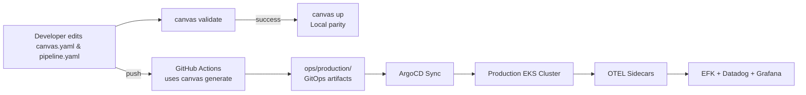

# 🎨 Canvas: The Engineering Platform

> **"Don't build clusters. Paint the vision."**

Canvas is the Internal Developer Platform (IDP) powering the Immersive Craft AI startup. It provides a "Golden Path" for engineering, abstracting the complexities of Kubernetes, Security, and Observability into simple, developer-centric blueprints.

## 🎯 Mission

The core mission of Canvas is to enable developers to ship production-ready microservices without managing infrastructure. We enforce a strict separation of concerns:

* **Developers** define **"What"** they need (CPU, Memory, Ports).
* **Canvas** defines **"How"** it happens (Ingress, HPA, Sidecars, Security Contexts).

## 🏗️ Architecture: The Four Planes

Canvas operates across four distinct planes, ensuring speed, security, and stability from code commit to production runtime.

### 1. Developer Experience Plane (The Interface)
The entry point for all engineering work. Developers interact solely with high-level configuration files in their service repositories.

* **Interface:** `canvas.yaml` and `pipeline.yaml`.
* **The Canvas CLI:** A local tool for developers to validate and bootstrap their services (e.g., `canvas validate`, `canvas up` for local Docker Compose environments).

### 2. Integration & Delivery Plane (The Engine)
This is the automation layer that converts developer intent (`canvas.yaml`) into deployable infrastructure (`Deployment.yaml`).

* **The Canvas Engine:** A Python-based orchestrator that reads the high-level blueprints and uses **Universal Helm Charts** to generate security-hardened Kubernetes manifests.
* **GitOps (ArgoCD):** Automatically watches the generated manifests in the `ops/` directory and syncs them to the production EKS cluster in real-time.

### 3. Observability Plane (Built-in Monitoring)
Canvas provides visibility by default, requiring zero configuration from the application developer.

* **Standardization:** The Canvas Engine automatically injects **OpenTelemetry (OTEL)** sidecars into every pod.
* **Logs:** Automatically collected by OTEL and routed to the **EFK Stack** (Elasticsearch, Fluentd, Kibana).
* **Metrics & APM:** Traces and metrics are automatically sent to **Datadog**.
* **Dashboarding:** All services adhere to a single data contract, enabling the use of universal Grafana dashboards.

### 4. Security Plane (Guardrails & Secrets)
Security is treated as a foundational requirement, not an optional step.

* **Guardrails:** The Engine rejects `canvas.yaml` configurations that request unsafe permissions (e.g., `root` access or excessive K8s capabilities).
* **Secrets:** Developers reference secrets by name (e.g., `GEMINI_API_KEY`). The Engine configures the **External Secrets Operator** to fetch the actual value from **AWS Secrets Manager** at runtime.
* **Scanning:** **SonarQube (SAST)** and **Trivy (Container)** scans are mandatory steps in the build pipeline (`pipeline.yaml`).

---

## 📝 The Canvas Contract (Blueprints)

Developers only need to reason about three declarative inputs that live alongside their service:

- `canvas.yaml`: Declares runtime, compute, networking, and dependency intent for a service. Canvas enforces guardrails so developers cannot request unsafe capabilities.
- `pipeline.yaml`: Chooses a vetted CI/CD template, toggles security scans, and defines artifact publishing rules. Pipeline authors never write raw GitHub Actions.
- `.env` (local only): Optional convenience file for running `canvas up`. Production secrets stay in the Security Plane (External Secrets Operator + AWS Secrets Manager).

These files remain the single source of truth; the README need only describe them so they stay lightweight and discoverable in the repo.

# 📂 Repository Structure
The Canvas platform enforces a standardized monorepo layout so every team shares identical guardrails:

```
repo-root/
├── .github/
│   └── workflows/
│       └── ci-text-service.yaml        # CI pipeline invoking Canvas Engine
├── services/
│   └── text-service/                   # Example product service
│       ├── app/                        # FastAPI application code
│       ├── canvas.yaml                 # Runtime declaration (contract)
│       ├── pipeline.yaml               # Build/CI declaration
│       ├── Dockerfile                  
│       ├── example.env                 # Local-only secrets scaffold
│       └── tests/                      # Service-specific tests
├── platform/
│   ├── README.md                       # This document
│   └── engine/                         # Canvas Engine CLI
│       ├── main.py                     # Typer application entrypoint
│       ├── pyproject.toml              # Project metadata & dependencies
│       ├── uv.lock                     # Locked dependency graph
│       ├── templates/                  # Universal Helm/Jinja2 charts
│       │   ├── deployment.yaml.j2
│       │   ├── service.yaml.j2
│       │   └── ingress.yaml.j2
│       └── canvas_engine.egg-info/     # Build artifacts (generated)
├── ops/
│   └── production/
│       └── text-service/
│           ├── 01-deployment.yaml      # Generated by `canvas generate`
│           ├── 02-service.yaml
│           └── 03-ingress.yaml
└── README.md                           # Product-level overview
```

## 🔄 How Canvas Ships Code

Canvas follows a predictable, developer-friendly loop that keeps abstractions high-level while ensuring production-grade rigor:

1. **Author the Contract** – Developers describe intent in `canvas.yaml` and `pipeline.yaml`. These files live with the service and capture runtime, security, and delivery requirements.
2. **Validate & Prototype** – The Canvas CLI (`canvas validate`, `canvas up`) runs locally to catch schema issues early and spin up Docker-based environments that match production wiring.
3. **Automate in CI/CD** – The Engine runs inside GitHub Actions using the same CLI. It executes quality gates, builds container images, and calls `canvas generate` to hydrate Kubernetes manifests in `ops/`.
4. **GitOps Promotion** – ArgoCD (or any GitOps controller) detects the new manifests under `ops/production/<service>` and syncs them into the target EKS cluster, closing the loop.

Because every plane consumes the same contract, Canvas guarantees parity between local, CI, and production without custom scripting per service.

## 🧰 Canvas CLI

The CLI lives in `platform/engine` and is distributed via the `canvas` entrypoint (Typer-based). Install it locally with [uv](https://docs.astral.sh/uv/):

```bash
cd platform/engine
uv venv .venv
source .venv/bin/activate
uv pip install -e .
```

Once installed, `canvas --help` exposes the following core commands (paths relative to repo root):

- `canvas validate services/text-service`  
  Parses `canvas.yaml`, confirms `kind: CanvasService`, and surfaces schema violations before CI wastes time.

- `canvas up services/text-service`  
  Builds the Docker image, injects env vars plus optional `.env` secrets, and runs the container exposing the declared port for local smoke tests.

- `canvas generate services/text-service --image-tag <sha>`  
  Renders `deployment`, `service`, and conditional `ingress` manifests using the Jinja2 templates in `platform/engine/templates`, writing results to `ops/production/<service>`. CI supplies the `--image-tag` (usually the commit SHA) so GitOps deploys immutable images.

### CLI tips
- Run commands from the monorepo root so relative paths resolve correctly.
- Templates are Jinja2—extending them automatically propagates to every service.
- Rich-powered output surfaces generated files and warnings in a single table for easy triage.

## 🧭 End-to-End Architecture



## ⚡ Quickstart for New Developers

1. **Clone & Bootstrap**
   - `git clone` the repo and install prerequisites (Python ≥3.10, Docker, uv, AWS CLI).
   - Install the CLI using the uv workflow described above.

2. **Explore a Reference Service**
   - Inspect `services/text-service/canvas.yaml` and `pipeline.yaml` to understand the contract.
   - Copy the directory when bootstrapping a new service; rename metadata fields immediately.

3. **Iterate Locally**
   - Run `canvas validate services/<your-service>` after every contract change.
   - Use `canvas up services/<your-service>` to run the container locally with the declared port and env.

4. **Commit & Generate**
   - Update service code and blueprints, then run `canvas generate ... --image-tag <commit-sha>` to refresh manifests.
   - Commit both blueprint edits and the resulting `ops/production/<your-service>` files.

5. **Merge & Observe**
   - Open a PR; the GitHub workflow will rerun validation, tests, builds, and manifest generation.
   - After merge, watch ArgoCD roll out the change and confirm telemetry in the shared dashboards.

## 🛠️ Contributing as a Platform Engineer

- **Extend Templates Thoughtfully**: Update `platform/engine/templates/*.j2` to add new patterns (e.g., sidecars, policies). Keep template inputs aligned with `canvas.yaml` fields to avoid breaking existing services.
- **Evolve the CLI**: Add Typer commands or options in `platform/engine/main.py` when platform capabilities grow. Always provide rich output and guards around destructive actions.
- **Guardrail Upgrades**: Introduce schema validation (e.g., Pydantic) in `load_blueprint` and layer in policy checks before manifests are rendered.
- **CI Enhancements**: Modify `.github/workflows/*.yaml` to add new quality gates or continuous verification, but continue invoking the CLI so behavior stays centralized.
- **Document Changes**: Update this README plus service-level docs whenever new flags, templates, or processes land so developers stay on the Golden Path.

